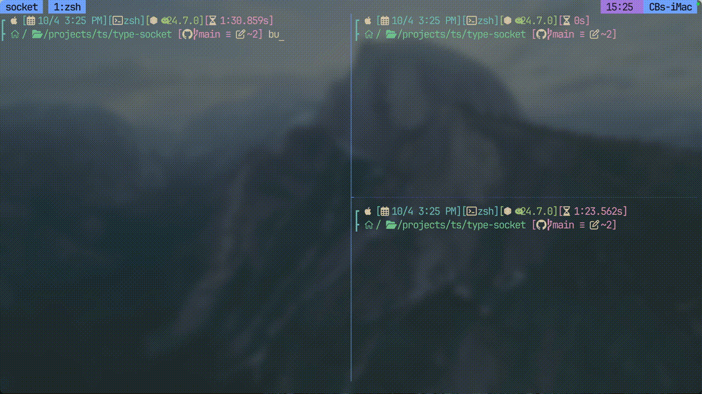

# typechat 
## Terminal-based Chatroom
terminal chatroom using Bun & WebSockets. supports multiple clients on one server.

<div align="center">
  
</div>

### Installation
```bash
git clone https://github.com/beaualbritton/typechat.git
cd typechat 
bun install
```

#### Run server 
```bash
bun run server
```

#### Run client 
```bash
bun run client
```

### Dependencies  
- [bun v1.2](https://bun.com/)

## Roadmap: 
- user typing events
- multiple rooms
- user authentication
- custom text effects

### Additional resources:
- [bun websockets](https://bun.com/docs/api/websockets)
- [bun stdin](https://bun.com/guides/process/stdin)
